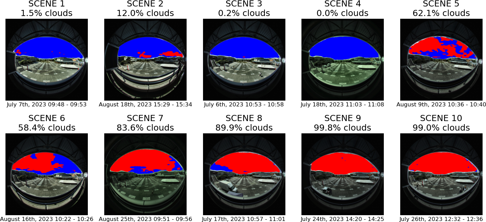
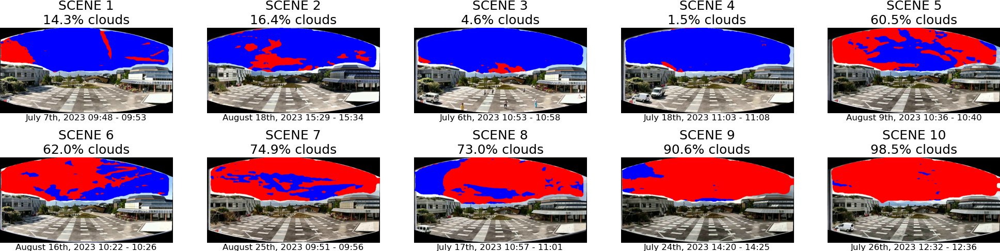
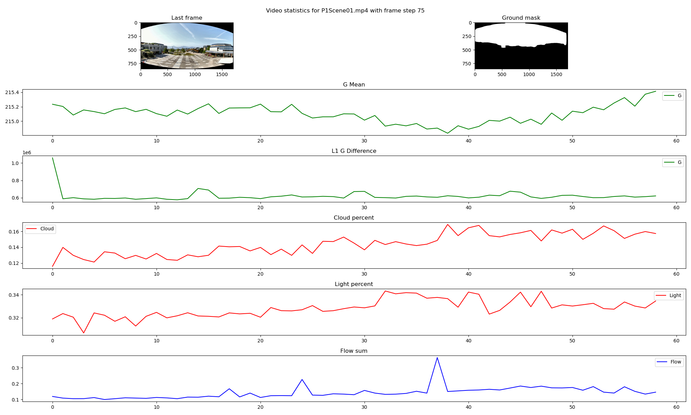

# Daylight Dynamics: A New Approach to Analyzing Luminous Variability

## Introduction

This GitHub repository is dedicated to the research project "Daylight Dynamics: A New Approach to Analyzing Luminous Variability". It provides a centralized platform for accessing all materials related to our study on the temporal dynamics of natural light and its implications in daylighting and built environments.

## Repository Contents

* **LDR Image Processing**
    * Code: [📁 processing](/src/processing/)
* **Ground Segmentation**
    * Trained weights: [📄 DeepLabV3 with MobileNetV3Large](/data/sky_ground_segmentation/models/deeplabv3mobilenetv3large_ranger_pretrained.pth) [📄 DeepLabV3 with ResNet101](/data/sky_ground_segmentation/models/deeplabv3resnet101_ranger_pretrained.pth)
    * Training code: [📁 sky_ground_segmentation](/src/sky_ground_segmentation/)
    * Notebook: [📓 sky_ground_segmentation.ipynb](/notebooks/sky_ground_segmentation.ipynb)
* **Cloud Segmentation**
    * Trained weights: [📄 DeepLabV3 with ResNet101](/data/sky_cloud_segmentation/models/deeplabv3resnet101_ranger_pretrained.pth)
    * Training code: [📁 sky_cloud_segmentation_dl](/src/sky_cloud_segmentation_dl/)
    * Notebook: [📓 sky_cloud_segmentation.ipynb](/notebooks/sky_cloud_segmentation.ipynb)
* **Cloud Coverage Estimation**
    * Code: [📁 cloud_coverage](/src/cloud_coverage/)
    * Images: [📁 cloud_coverage](/generated/cloud_coverage/)
* **LDR Global Lighting Distribution, Luminous Change Intensity and Magnitude**
    * Code: [📁 gld_lcim](/src/gld_lcim/)
    * Images: [📁 gld_lcim](/generated/gld_lcim/)

## Installation Guide

This section guides you through the process of setting up the necessary environment and software to reproduce the results of our study.

### Prerequisites

Before beginning, ensure you have the following installed:

* Python (version 3.11.5)
* Conda (version 23.7.4)
* Git (for cloning the repository)

### Cloning the Repository

Clone the repository to your local machine using Git:

```bash
git clone https://github.com/pqhqhyvn/DaylightDynamics
cd DaylightDynamics
``` 

### Environment Setup

It is recommended to create a new Conda environment for this project to manage dependencies effectively. Use the provided [environment.yml](/environment.yml) file to create the environment:

```bash
conda env create -f environment.yml
conda activate dd
```

### Running the Code

Follow the README instructions for each part of the project to reproduce the results.

## 1. LDR Image Processing

### 1.1 Description

Our image processing approach involves standardizing each scene for consistent analysis:

* Bilateral filtering with a 13x13 pixel kernel is applied to reduce noise while retaining key edge details.
* Contrast Limited Adaptive Histogram Equalization (CLAHE) enhances contrast and visibility in varied lighting.
* To mitigate flicker noise, we employ a moving average technique over three consecutive frames for each frame in the sequence.

### 1.2 Reproducing the Results

To reproduce the results, follow these steps:

1. Download the raw videos used in the study and place them in the [data/ldr/raw](/data/ldr/raw/) directory in the following structure:
    ```bash
    data
    ├── ldr
    │   ├── raw
    └   └   └ P1SceneXX.mp4
    ```


2. Go to the [src/processing](/src/processing/) directory:
    ```bash
    cd src/processing/  # On Windows use `cd src\processing\`
    ```

3. Run the following command:
    ```bash
    python processing.py --num_processes <num_processes> --mask_reframe <mask_reframe>
    ```
    Where:
    * `<num_processes>` is the number of processes to use for parallel processing. If not specified, the default value is your CPU's number of cores.
    * `<mask_reframe>` whether to reframe the video or not. If not specified, the default value is `False`.

    Processed videos will be saved in the [data/ldr/processed](/data/ldr/processed/) or [data/ldr/processed_reframed](/data/ldr/processed_reframed/) directory, depending on the processing method selected.
    

## 2. Ground Segmentation

### 2.1. Description

In our analysis of daylight dynamics in urban settings, a key task involves segmenting the sky from the ground in urban images. This segmentation is crucial as a foundational step for our subsequent analyses and interpretations within these environments. We employ the DeepLabV3 model, specifically chosen for its proficiency in handling such complex segmentation tasks in diverse urban landscapes.

The decision to use DeepLabV3 is supported by its foundational paper [1], which showcases its superior capabilities in urban outdoor scenes. Additionally, another paper [2] illustrates its use in machine vision for off-road vehicles, where it managed complex outdoor scene segmentation, a challenge akin to our task in urban landscapes. This similarity in application contexts highlights DeepLabV3 as an ideal model for our project's specific needs in environmental segmentation.

Here are examples of training and validation samples from our custom dataset ([see this notebook](/notebooks/sky_ground_segmentation.ipynb)):

<p float="left">
  
  
</p>

### 2.2. Trained Weights

Weights for the DeepLabV3 model with MobileNetV3Large backbone can be found [here](/data/sky_ground_segmentation/models/deeplabv3mobilenetv3large_ranger_pretrained.pth). Alternatively, a similar model with ResNet101 backbone can be found [here](/data/sky_ground_segmentation/models/deeplabv3resnet101_ranger_pretrained.pth).

### 2.3. Errors and Limitations

The model may encounter errors when distinguishing between the sky and the ground in certain situations. These errors are often related to reflections of the sky on surfaces like buildings and windows, as well as small details such as poles, wires, cranes, or road signs. It's important to acknowledge these limitations when using the segmentation results in outdoor environments.

### 2.4. Reproducing the Results

To reproduce the results, follow these steps:

1. Download the necessary datasets and place them in the [data/sky_ground_segmentation](/data/sky_ground_segmentation/) directory. They contain images and binary masks for the following datasets:
    * [ADE20K Outdoors](https://www.kaggle.com/datasets/residentmario/ade20k-outdoors): A subset of the [ADE20K](https://groups.csail.mit.edu/vision/datasets/ADE20K/) [5] dataset, containing images of outdoor scenes.
    * [Cityscapes](https://www.cityscapes-dataset.com/) [6]: A dataset of urban street scenes.
    * [Mapillary Vistas](https://www.mapillary.com/dataset/vistas) [7]: A dataset of diverse street scenes.
    * [Sky Finder](https://mvrl.cse.wustl.edu/datasets/skyfinder/) [8]: A dataset of outdoor scenes with sky and ground segmentation.
    * [Sun2012](https://groups.csail.mit.edu/vision/SUN/hierarchy.html) [9]: A dataset of various scenes, which have been filtered manually to include outdoor images only.
    * [Swimseg](https://paperswithcode.com/dataset/swimseg) [10]: A dataset of sky patches.

    Processing steps have been applied to guarantee that the masks in the dataset are binary, effectively distinguishing between sky and ground in each image. The datasets are organized in the following structure:

    ```bash
    data
    ├── sky_ground_segmentation
    │   ├── ade20k_outdoors
    │   │   ├── images
    │   │   │   ├ ADE_train_XXXXXXXX.jpg
    │   │   │   └ ...
    │   │   └── masks
    │   │       ├ ADE_train_XXXXXXXX.png
    │   │       └ ...
    │   ├── cityscapes
    │   │   ├── images
    │   │   │   ├ X.png
    │   │   │   └ ...
    │   │   └── masks
    │   │       ├ X.png
    │   │       └ ...
    │   ├── mapillary_vistas
    │   │   ├── images
    │   │   │   ├ X.jpg
    │   │   │   └ ...
    │   │   └── masks
    │   │       ├ X.png
    │   │       └ ...
    │   ├── sky_finder
    │   │   ├── images
    │   │   │   ├── X
    │   │   │   │   ├ X.jpg
    │   │   │   │   └ ...
    │   │   │   ├── ...
    │   │   │   └ masks
    │   │   │       ├ X.png
    │   │   │       └ ...
    │   ├── sun2012
    │   │   ├── images
    │   │   │   ├ X.jpg
    │   │   │   └ ...
    │   │   └── masks
    │   │       ├ X.png
    │   │       └ ...
    │   ├── swimseg
    │   │   ├── images
    │   │   │   ├ XXXX.jpg
    │   │   │   └ ...
    │   │   └── masks
    └   └       └ mask.png
    ```

2. Go to the [sky_ground_segmentation](/src/sky_ground_segmentation/) directory:

    ```bash
    cd src/sky_ground_segmentation/   # On Windows use `cd src\sky_ground_segmentation\`
    ```

3. Run the following command:

    ```bash
    python train.py --model_type <model_type>
    ```
    Where `<model_type>` is the type of the model to train. It can be either `deeplabv3mobilenetv3large` or `deeplabv3resnet101`. If not specified, the default value is `deeplabv3mobilenetv3large`.

## 3. Cloud Segmentation

### 3.1. Description

Our task involves estimating cloud coverage using DeepLabV3 for cloud segmentation. We trained the model on a custom-labeled dataset sourced from Sky Finder [3], which encompasses a wide range of landscape images featuring diverse sky conditions, various weather types, and different times of the day. This dataset features labels for four distinct classes: 
* Ground: already provided by the Sky Finder dataset.
* Sky: representing clear blue sky.
* Light clouds: characterizing clouds with light passing through them, often veil-thin clouds.
* Thick clouds: representing darker clouds that typically do not allow light to pass through.

Traditional cloud segmentation methods, like those in [4], typically utilize spectral analysis on RGB images to differentiate between sky and cloud pixels. However, these methods have limitations in handling varied sky conditions, and may struggle with accurate classifications under direct sunlight, atmospheric pollution, or overexposure effects. These challenges underscore the necessity for more sophisticated techniques such as DeepLabV3, which can more effectively adapt to and accurately segment in these complex environmental scenarios.

Here are examples of training and validation samples from our custom dataset ([see this notebook](/notebooks/sky_cloud_segmentation.ipynb)):

<p float="left">
  
   
</p>


### 3.2. Trained Weights

Weights for the DeepLabV3 with ResNet101 backbone can be found [here](/data/sky_cloud_segmentation/models/deeplabv3resnet101_ranger_pretrained.pth).

### 3.3. Errors and Limitations

While we have endeavored to minimize errors, the model may occasionally misclassify overexposed clear sky as clouds. It's worth noting that our analysis does not distinguish between thin and thick clouds. This means that the model does not differentiate between varying cloud density, and these differences can have varying impacts on sky luminosity. As a result, the model may not provide precise insights into luminance levels on its own under these varying cloud conditions.

### 3.4. Reproducing the Results

To reproduce the results, follow these steps:

1. Go to the [sky_cloud_segmentation_dl](/src/sky_cloud_segmentation_dl/) directory:

    ```bash
    cd src/sky_cloud_segmentation_dl/  # On Windows use `cd src\sky_cloud_segmentation_dl\`
    ```

2. Run the following command:

    ```bash
    python train.py
    ```

## 4. Cloud Coverage Estimation

### 4.1. Description

We employ the [cloud segmentation](#3-cloud-segmentation) model to estimate cloud coverage in both Low Dynamic Range (LDR) and High Dynamic Range (HDR) scenes. For HDR scenes, an essential preprocessing step is tone-mapping, which adjusts the scenes to a standard dynamic range suitable for analysis. The model processes these scenes to generate a segmentation mask, differentiating between sky and clouds. This mask is then utilized to accurately estimate cloud coverage, providing critical data for analyzing the impact of clouds on urban daylight conditions.

The results of this analysis on HDR images are shown below:



The results of this analysis on LDR videos are shown below:



### 4.2. Reproducing the Results

To reproduce the results, follow these steps:

1. If you want to process LDR videos, follow the instructions in the [LDR Image Processing](#1-ldr-image-processing) section. Otherwise, if you want to process HDR images, skip this step.

3. Go to the [cloud_coverage](/src/cloud_coverage/) directory:

    ```bash
    cd src/cloud_coverage/ # On Windows use `cd src\cloud_coverage\`
    ```

4. Run the following command:

    ```bash
    python cloud_coverage.py
    ```
    Generated images will be saved in the [cloud_coverage](/generated/cloud_coverage/) directory.

## 5. LDR Global Lighting Distribution, Luminous Change Intensity and Magnitude

### 5.1. Description

In this section of the study, we delve into the intricacies of Low Dynamic Range (LDR) imaging to analyze global lighting distribution, luminous change intensity, and magnitude across various scenes. Key aspects of our analysis include assessing the mean and variance of brightness in LDR footage, exploring the changes in global brightness across different scenes, and understanding the interplay between cloud movements, light changes, and scene dynamics.

Each scene in our study is subject to a detailed evaluation, exemplified by the plot generated for Scene 1. This plot, as illustrated below, is a result of image processing techniques applied to LDR footage:



This visual representation for Scene 1 is a part of a series where each scene is individually analyzed. The plots are meticulously crafted to provide insights into the lighting dynamics specific to each scene, capturing subtle nuances and patterns of natural light variations.

In addition to individual scene analysis, we have compiled an overarching box plot that amalgamates the results from all scenes, presenting a holistic view of the study:


This collective plot serves as a crucial tool for understanding broader lighting trends and variations across different scenes. It not only highlights the diversity in lighting conditions but also facilitates a comparative analysis, enabling us to discern patterns that may not be apparent when examining scenes individually.

### 5.2. Reproducing the Results

To reproduce the results, follow these steps:

1. Process the LDR videos using the instructions in the [LDR Image Processing](#1-ldr-image-processing) section.

2. Go to the [gld_lcim](/src/gld_lcim/) directory:

    ```bash
    cd src/gld_lcim/ # On Windows use `cd src\gld_lcim\`
    ```

3. To generate individual plots for each scene, run the following command:

    ```bash
    python scenes_analysis.py
    ```
    Generated images will be saved in the [gld_lcim](/generated/gld_lcim/) directory.

4. To generate the box plot, run the following command:

    ```bash
    python scenes_plotting.py
    ```
    Generated images will be saved in the [gld_lcim](/generated/gld_lcim/) directory.

## References

1. Chen, L., Papandreou, G., Schroff, F., & Adam, H. (2017). Rethinking Atrous Convolution for Semantic Image Segmentation. arXiv:1706.05587. [Link](https://ar5iv.labs.arxiv.org/html/1706.05587)

2. I. Sgibnev et al., "Deep semantic segmentation for off-road autonomous driving," The International Archives of Photogrammetry, Remote Sensing and Spatial Information Sciences, vol. 43, pp. 617–622, 2020.

3. Mihail, Radu Paul, Scott Workman, Zach Bessinger, and Nathan Jacobs. "Sky Segmentation in the Wild: An Empirical Study." In IEEE Winter Conference on Applications of Computer Vision (WACV), 2016. doi:10.1109/WACV.2016.7477637.

4. Dev, Soumyabrata, Yee Hui Lee, and Stefan Winkler. "Systematic Study of Color Spaces and Components for the Segmentation of Sky/Cloud Images." School of Electrical and Electronic Engineering, Nanyang Technological University (NTU), Singapore, and Advanced Digital Sciences Center (ADSC), University of Illinois at Urbana-Champaign, Singapore. 2017. arXiv:1701.04520. [Link](https://arxiv.org/pdf/1701.04520.pdf)

5. Xia, Weihao, Cheng, Zhanglin, Yang, Yujiu, & Xue, Jing-Hao. (2020). Cooperative Semantic Segmentation and Image Restoration in Adverse Environmental Conditions. arXiv:1911.00679. [Link](https://arxiv.org/abs/1911.00679)

6. Cordts, Marius, Omran, Mohamed, Ramos, Sebastian, Rehfeld, Timo, Enzweiler, Markus, Benenson, Rodrigo, Franke, Uwe, Roth, Stefan, & Schiele, Bernt. (2016). The Cityscapes Dataset for Semantic Urban Scene Understanding. arXiv:1604.01685. [Link](https://arxiv.org/abs/1604.01685)

7. Neuhold, Gerhard, Ollmann, Tobias, Bulò, Samuel Rota, & Kontschieder, Peter. (2017). The Mapillary Vistas Dataset for Semantic Understanding of Street Scenes. In Proceedings of the 2017 IEEE International Conference on Computer Vision (ICCV), pp. 5000-5009. doi:10.1109/ICCV.2017.534.

8. Mihail, Radu Paul, Workman, Scott, Bessinger, Zach, & Jacobs, Nathan. (2016). Sky Segmentation in the Wild: An Empirical Study. In Proceedings of the IEEE Winter Conference on Applications of Computer Vision (WACV), pp. 1-6. doi:10.1109/WACV.2016.7477637. Acceptance rate: 42.3%. [PDF](https://drive.google.com/file/d/1-76FxbBQW8oD2m0JnCkZ7RTz-t541TiD/view?usp=sharing). Project: [SkyFinder](https://mvrl.github.io/SkyFinder/).

9. Xiao, Jianxiong, Hays, James, Ehinger, Krista A., Oliva, Aude, & Torralba, Antonio. (2010). SUN database: Large-scale scene recognition from abbey to zoo. In Proceedings of the 2010 IEEE Computer Society Conference on Computer Vision and Pattern Recognition, pp. 3485-3492. doi:10.1109/CVPR.2010.5539970.

10. Dev, Soumyabrata, Lee, Yee Hui, & Winkler, Stefan. (2016). Color-based Segmentation of Sky/Cloud Images From Ground-based Cameras. arXiv:1606.03669. [Link](https://arxiv.org/abs/1606.03669)

11. Zhuang, Juntang, Tang, Tommy, Ding, Yifan, Tatikonda, Sekhar, Dvornek, Nicha, Papademetris, Xenophon, & Duncan, James. (2020). AdaBelief Optimizer: Adapting Stepsizes by the Belief in Observed Gradients. In Proceedings of the Conference on Neural Information Processing Systems.
